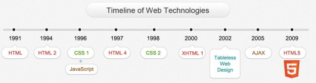

class: center, middle

#FEWD - Day 1!!! 

###Hello, worlds

---

##Agenda

*	Welcome & Introductions
*	Understanding GitHub
*	HTML Basics + Code-along
*	HTML Cookie Recipe Lab 

---

##Understanding GitHub

We will be using GitHub to share class resources, starter code, and also as a platform for homework submission.  We are also teaching you GitHub because it is used very widely across the industry to manage teams of developers working on the same codebase.

---

##What is GitHub?

* GitHub is a platform makes it easy to manage git repositories. It is now commonplace in any company that works with engineers.
* Stores files like Dropbox or Google Drive, but stores code.
* Stores a history of files and the changes that happens within each changed document.
* Hosts files on the cloud so you can share the finished product with other people.
* Git - the technology that Github is based on top of - was designed to allow for multiple engineers to work on the same project.

---

####Why is GitHub Valuable? Why do developers use GitHub?

* Since GitHub stores a history of the code, it allows developers to go back in time if something breaks.
* GitHub allows multiple developers to work on the same project. Much like Dropbox or Google Drive lets multiple people collaborate on the same document, GitHub allows this for code.
* GitHub tracks changes so you can see who worked on what.
* GitHub allows for feedback to be given on the code, which hopefully, increases code quality. Much like an editor updates a Word document using Track Changes, GitHub allows a similar environment.

---

####How does GitHub work in a collaborative environment?

GitHub's collaborative process can work many different ways, but this is the most common:

1. Each GitHub project is called a "repository". Engineers joining a team start by "cloning" the repository (or repo, for short).
    - Remember: "Clone" means that we are copying our GitHub repository from the cloud and saving it as a local folder on our computer.
2. The main, stable version of the codebase is on the default "branch" in GitHub which is called "master".
    - Engineers typically create new branches for certain features or portions of the code they will work on, but we won't be creating branches in this class in this class.
3. As engineers are working on a project, they "add" and "commit" their changes. This establishes a saved version of a project and creates a history of what they are working on.  With these saved versions, engineers are able to revert to an earlier version if an issue arises that cannot be fixed.
4. If there are multiple engineers working on a project, other engineers can review the code that is committed and provide feedback.  For this class, the instructors will be reviewing and providing feedback on your code. 
  - We will be working with our own default "master" branch for each of our projects. 

---

####Some important vocabulary relating to Git/GitHub

* **git** - a version control program that saves the state of your project's files and folders; basically, it takes a "snapshot" of what all your files look like at a moment and stores a reference to that "snapshot"
  * Note: you may want to compare git to an organizational backup tool used to save and organize work; be wary of your class' experience and try not to introduce too many industry-specific vocabulary
* **repository** - a central location in which data - typically about a project - is stored and managed
* **clone** - download data from the cloud to your local machine (laptop, computer, etc.)
* **commit** - save a version of your project to git 

---
##WE DO:

1. 	First we will all **clone** the <a href="https://github.com/ga-students/FEWD_DTLA_7">FEWD_DTLA_7</a> **repository** - this is where our lesson resources will be updated.
2. 	Next, let's all create a new **repository**, add a file, **commit** the change, and sync with our remote master branch.

---

##Submitting Assignments

1.	Upload your project to GitHub (following the steps to create a new repository, add project files, and sync/publish to GitHub).
2.	Get the link for your project and Slack it to Emma and Sam.
3.	You will receive <a href="https://www.youtube.com/watch?v=gQzWFRKZUSA&feature=youtu.be&hd=1">feedback</a> via in-line comments within your latest commit on GitHub on your project's repository.  Assessment rubrics for larger projects will be provided in GitHub issues.

---

#HTML Basics

---

##HTML Tags & CSS Selectors Review
###Turn and talk (5 min)

*	What is an HTML tag?
*	What is a CSS selector?
*	What is an example of an HTML tag?
*	What is an example of a CSS selector?

---

##HTML vs HTML5

HTML5 is HTML with a few additions
The Doctype tells you if the page is HTML5 ready.

`<!DOCTYPE html>`

---

##HTML HISTORY

Note:
image retrieved from http://www.onbile.com/info/wp-content/uploads/2013/09/Timeline-of-web-technologies-639x168.jpg on October 1, 2013.

---

##HTML Syntax

**Note:** While many, if not most, HTML elements follow this convention, not all do.  We will discuss exceptions to this rule in our next class, but if you find yourself thinking "hey, we had to work with a tag in our pre-work that doesn't have a closing tag!", give yourself a pat on the back for being exceptionally observant :)

---

##HTML Syntax

---

##Content Tags

Heading Elements

`<h1>`Largest Heading`</h1>`

`<h2>` . . . `</h2>`

`<h3>` . . . `</h3>`

`<h4>` . . .`</h4>`

`<h5>` . . . `</h5>`

`<h6>`Smallest Heading`</h6>`

---

##Content Tags

Text Elements

`
`This is a paragraph`
`

`<code>`This is some computer code`</code>`

---

##Content Tags

Unordered list

`<ul> </ul>`

---

##Content Tags

Unordered list item


`<li>`First item`</li>`

`<li>`Next item`</li>`

---

##Content Tags

Links

`<a href="Link">`First item`</a>`

---

##General Assembly Press Release

---

##External Style Sheets 

---

##Cookie Recipe

---
## Review 

*	What are the main elements that every document must have to be rendered as valid HTML?
*	What are 2 ways to add style to an HTML document?  Which one do you think is better and why?

---

## Homework

*	Finish Cookie recipe lab + submit a link to your work on GitHub to receive feedback
*	Watch a <a href="https://www.youtube.com/watch?v=7_LPdttKXPc">video</a> on the Internet about the Internet
*	Read about <a href="http://www.w3schools.com/cssref/css_colors.asp">CSS Colors</a>
*	**BONUS**: If you have extra time before next class and want to keep practicing, create a resume page for yourself, separating the different sections of content with the appropriate HTML tags.

---

## Resources

*	<a href="the_internet.md">How the Internet Works markdown</a>
*	<a href="http://www.w3schools.com/tags/">HTML Element Reference</a>
*	<a href="http://www.w3schools.com/css/css_howto.asp">Incorporating CSS into HTML</a>
*	<a href="http://www.w3schools.com/cssref/">CSS Reference</a>
*	<a href="">Review of GitHub process</a>

---
## Exit Ticket - Lesson #1, Topic: HTML Basics

###Please fill out the <a href="https://docs.google.com/forms/d/1Iw2zghHfGgeM1p1G16F6kLi7KViv28tG3HVNnoM3PAc/viewform">exit ticket</a> before you leave

