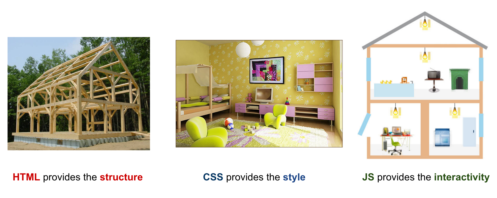

#FEWD - Intro Programming (!!!)

###Lesson #7 - Feb 29, 2016

"No one is dumb who is curious. The people who don't ask questions remain clueless throughout their lives." - <a href="http://www.haydenplanetarium.org/tyson/">Neil deGrasse Tyson</a>

---

##Agenda

*	Exit Tickets / Review
*	Introduction To Programming
*	What JS Can Do
*	Reading JS
*	Lab

---
#Exit Tickets

* 	Best approach for 3-column layout at bottom of Start-up Matchmaker

Answer: Put each column in its own `div`, and each column contained within a single `div` container.  Then use `display: inline-block` on each nested column `div`.

*	What are the best practices for the new HTML 5 tags?

Answer: Unless you need to support IE8, you can/should always strive to use HTML5 tags.

*	Is CSS animation skills highly valued in web development?

Answer: Depends on the kind of web development you're doing.  It's not usually required of a front-end developer, but definitely impresses companies/clients.

---
#Exit Tickets

*	does graduating as a front end developer come with a prescription for anti anxiety pills?

Answer: No, but a glass of bourbon at the end of the day usually helps :)

*	For style sheet, what would you put under base styles?

Answer:	These can include the base defaults for elements (`h1`, `p`, etc.) that you may overwrite in subsequent rules using nested selectors or classes.

*	Vertical rules....what's the best way to generate those as they are used all the time in visual designs?

Answer: `border-right` with a rule to leave off the border for the last column

 	

---

#Introduction To Programming

##In our first unit, we learned two languages: HTML and CSS.

While these are referred to as programming languages, their primary purposes are to structure content and to style content.  HTML is often referred to as a **markup language**, while CSS is referred to as a **styling language**.

##This is very different from the kind of programming we'll be doing with JavaScript.
JavaScript is a language with which we can create programs -- modular pieces of code that the computer interprets to perform a set of instructions.  We can also use JS to create algorithms - special programs that can solve very complex problems for us. 

---

##What is a Program

A __program__ is a set of instructions that you write to tell a computer what to do

---

##What Is Programming

__Programming__ is the task of writing those instructions in a language that the computer can understand.

---

##Becoming A Programmer

It isn't about the programming language. It is about changing how you think.

We have to know how the computer thinks to change how we think.

---

##How Computers ‘Think’

The short answer is that they don’t think.

The slightly longer answer is that while computers don’t think, they act as if they do, by sequentially executing simple instructions.

The only things a computer knows are the things we tell it.

---

##Pseudo Code

Pseudocode is the process of writing a program without using the syntax of a programming language.

Pseudocode is a mixture of natural language and high-level programming constructs. For example,

`If the door is closed and I want to exit the room, then open the door`

In this unit we will learn what these keywords and structures are, and how they are used to create a program.

Pseudocode is useful because it can help you organize the steps of your program, so that when you sit down to code, you only need to translate your pseudocode's logic into words the computer will understand.

`if (door.isClosed && self.wantsToExit) { door.open(); }`

---

##Thermostat

###Pseudo code for an application that would monitor the room temperature and adjust it so the room remains at a certain temperature.

---

##Rock Paper Scissors

###In groups of 3-4, whiteboard pseudocode to program a computer to play the game rock paper scissors.

---

##What is JavaScript, and how does it relate to HTML/CSS?

###Web development is kind of like building a house

---
##What can JavaScript do?

Review the interactive functionality on the following sites:

*	<a href="https://www.google.com/chrome/">Chrome.com""</a>
*	<a href="https://www.google.com/zeitgeist/2012/resolutions/">Google Zeitgeist Resolutions</a>
*	<a href="http://www.google.com/landing/now/">Google Now</a>
*	<a href="https://www.google.com/work/solutions.html">Google for Work - Solutions</a>

---

##Color Switcher

---

##Traffic Light

###Look through the <a href="http://codepen.io/emmacunningham/pen/wGvOyz">Traffic Light Codepen</a> and fix the following:
*	"Slow" button turns the light to purple, not yellow
*	"Go" button doesn't turn on at all!

---
##Homework

*	Practice writing JavaScript via <a href="http://javascript-roadtrip.codeschool.com/">JavaScript Roadtrip</a> (approx 2 hours total - do as much as you can, but don't feel rushed to finish! we will cover all of this in class)

---

##Exit Tickets - Lesson #7, Topic: Intro Programming

###Please fill out the <a href="https://docs.google.com/forms/d/1Iw2zghHfGgeM1p1G16F6kLi7KViv28tG3HVNnoM3PAc/viewform">exit ticket</a> before you leave
